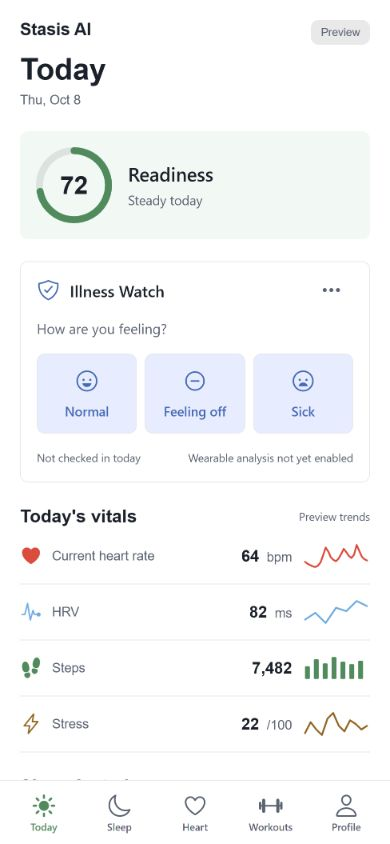
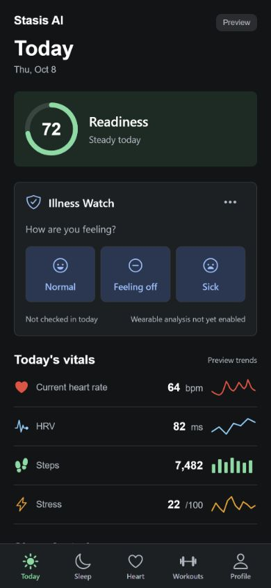
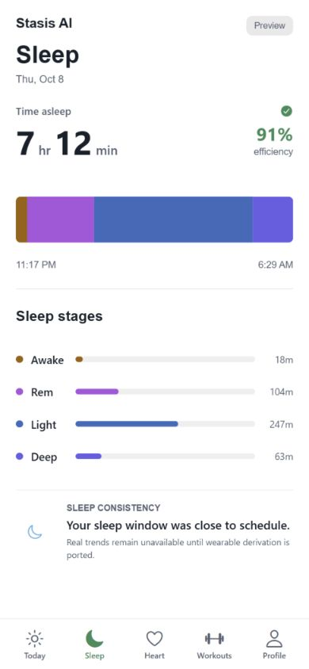
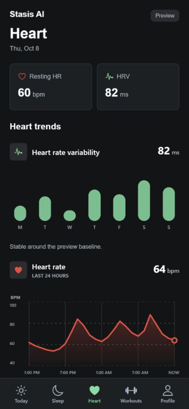

# Daily Check-In UI

The Expo app uses the third design concept: compact readiness, an early daily
check-in, metric rows, flat surfaces, and a fixed tab bar. The same typography,
spacing, surface treatment, and adaptive colors apply to Today, Sleep, Heart,
Workouts, Profile, Illness Watch, Coach, and Coach server settings.

Today's vitals include right-aligned sparklines: 24-hour heart rate, 7-day HRV,
7-day steps (bars), and today's stress. All series are preview fixtures;
"Preview trends" labels them visibly, and each chart has an accessible metric
and period label. Steps and stress series are illustrative and never persisted.

Today offers Normal, Feeling off, and Sick. Selecting one opens the editable
check-in form with that choice selected. Nothing is persisted until Save;
symptomatic reports still require severity. Existing reports remain editable.
Sensor values remain explicitly marked Preview, and wearable illness analysis
remains unavailable in this migration.

## Screenshots

| Today, Light | Today, Dark |
| --- | --- |
|  |  |

| Sleep, Light | Heart, Dark |
| --- | --- |
|  |  |

## Validation

- TypeScript: `npm run typecheck`.
- Jest: `npm test`; 5 suites, 20 tests, including selection, required severity,
  and retention of an edited feeling after saving.
- Production web export: `npx expo export --platform web --output-dir .codex-web-export`.
- Browser checks: all eight routes at 390 x 844 and 1440 x 1000, in both themes;
  document widths matched viewport widths. Also inspected the check-in form at
  320 x 740 and the Today-to-form navigation and accessible selected state.
- Native iOS/Android appearance uses the existing adaptive-color infrastructure;
  no physical-device visual verification was available for this change.

Web previews can be checked with `?theme=light` or `?theme=dark`. Without an
override, the app follows the system appearance.

## PR Scope

`main` does not yet contain the Expo app. The first commit brings over the
existing Expo migration from `b7b080d`; the second applies this design. The
Flutter app and unrelated edits in the original checkout are not part of the
redesign.
